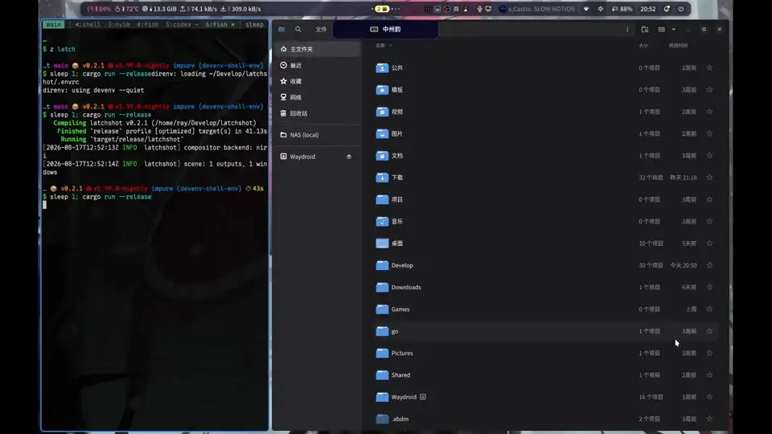

# Latchshot

A lightweight yet intelligent window-aware screenshot tool for Wayland. Latchshot freezes the current desktop, snaps to the window under the pointer, and falls back to a freely drawn region when you drag.

## Demo

[](assets/latchshot-demo.mp4)

## Requirements

Latchshot targets compositors that expose the Wayland protocols needed by its custom overlay. The compositor must support:

- [`wlr-layer-shell-unstable-v1`](https://wayland.app/protocols/wlr-layer-shell-unstable-v1) (`zwlr_layer_shell_v1`)
- [`viewporter`](https://wayland.app/protocols/viewporter) (`wp_viewporter`)
- At least one supported capture path:
  - [`ext-image-copy-capture-v1`](https://wayland.app/protocols/ext-image-copy-capture-v1) together with an output source from [`ext-image-capture-source-v1`](https://wayland.app/protocols/ext-image-capture-source-v1)
  - [`wlr-screencopy-unstable-v1`](https://wayland.app/protocols/wlr-screencopy-unstable-v1), together with [`xdg-output-unstable-v1`](https://wayland.app/protocols/xdg-output-unstable-v1)

### Compositor support

| Compositor | Status | Selection support |
| --- | --- | --- |
| [Niri (with a customized fork)](https://github.com/so1ve/niri/tree/feat/latchshot-support) | Supported | Window snapping and free-form regions |
| [Upstream Niri](https://github.com/niri-wm/niri) | Supported but limited | Window snapping and free-form regions |
| [Sway](https://github.com/swaywm/sway) | Supported | Window snapping and free-form regions |
| [Hyprland](https://github.com/hyprwm/Hyprland) | Supported | Window snapping and free-form regions |
| [Mango](https://github.com/mangowm/mango) | Supported | Window snapping and free-form regions |
| Other compatible Wayland compositors | Best effort | Free-form regions only |
| KDE Plasma | Intentionally unsupported | — |
| GNOME | Intentionally unsupported | — |

The `generic` backend is selected automatically for unknown compositors.

When upstream Niri rejects the custom `WindowGeometries` request, Latchshot reconstructs visible window positions from standard Niri IPC layout metadata and the frozen output pixels. **If an output cannot be resolved unambiguously, window snapping is disabled for that output rather than guessing.**

KDE Plasma and GNOME remain intentionally out of scope because Latchshot targets this protocol stack rather than portal- or desktop-shell-specific screenshot flows.

Copying to clipboard (the default destiniation) also requires `wl-copy` from [`wl-clipboard`](https://github.com/bugaevc/wl-clipboard).

## Installation

### From source

With Cargo:

```sh
cargo install latchshot
```

### Nix

Run directly:

```sh
nix run github:so1ve/latchshot
```

With a Nix flake, add Latchshot to the inputs:

```nix
inputs.latchshot.url = "github:so1ve/latchshot";
```

Then add the package to a NixOS configuration:

```nix
{ inputs, pkgs, ... }:

{
  environment.systemPackages = [
    inputs.latchshot.packages.${pkgs.stdenv.hostPlatform.system}.default
  ];
}
```

Alternatively, use the overlay to make `pkgs.latchshot` available:

```nix
{ inputs, pkgs, ... }:

{
  nixpkgs.overlays = [
    inputs.latchshot.overlays.default
  ];

  environment.systemPackages = [
    pkgs.latchshot
  ];
}
```

### Cachix

Use the project cache for prebuilt Nix artifacts when available:

```nix
nix.settings = {
  extra-substituters = [ "https://so1ve.cachix.org" ];
  extra-trusted-public-keys = [
    "so1ve.cachix.org-1:51jcW4FkJhiLcqPsiUx3nglRP469les8F9zjFxio1nw="
  ];
};
```

## Usage

Run Latchshot with no destination to copy the selected screenshot to the clipboard:

```sh
latchshot
```

During selection:

- Move the pointer to highlight the window underneath it.
- Left-click a highlighted window to capture it.
- Left-drag to select an arbitrary region.
- Press <kbd>F</kbd> to capture the output under the pointer.
- Press <kbd>Esc</kbd> or right-click to cancel.

Save directly to a file:

```sh
latchshot --output ~/Pictures/screenshot.png
```

Write PNG data to standard output:

```sh
latchshot --stdout > screenshot.png
```

Destinations can be combined. For example, this saves the screenshot to a
file, streams it to standard output, and copies it to the clipboard:

```sh
latchshot --output ~/Pictures/screenshot.png --stdout --clipboard > screenshot-copy.png
```

To disable animation:

```sh
latchshot --no-animation
```

To disable desktop notifications:

```sh
latchshot --no-notify
```

Print the discovered scene as JSON for diagnostics:

```sh
latchshot --windows
```

Force Niri's standard-IPC window reconstruction path for diagnostics:

```sh
LATCHSHOT_NIRI_FORCE_FALLBACK=1 latchshot
```

Run `latchshot --help` for all options. Set `RUST_LOG=latchshot=debug` for additional diagnostics.

## Workflow Examples

Annotate with [Satty](https://github.com/gabm/Satty), save the result as a
timestamped file under `~/Pictures`, and play the desktop's screenshot sound.
Press <kbd>Enter</kbd> in Satty when finished:

```sh
file="$HOME/Pictures/latchshot-$(date +'%Y-%m-%d_%H-%M-%S').png"; latchshot --stdout | satty --filename - --output-filename "$file" --actions-on-enter=save-to-file,exit; test -s "$file" && canberra-gtk-play --id=screen-capture
```

The equivalent workflow with [Swappy](https://github.com/jtheoof/swappy)
writes the annotated image when Swappy exits:

```sh
file="$HOME/Pictures/latchshot-$(date +'%Y-%m-%d_%H-%M-%S').png"; latchshot --stdout | swappy --file - --output-file "$file"; test -s "$file" && canberra-gtk-play --id=screen-capture
```

## Library Usage

Latchshot can also be used as a Rust library. See the [API documentation on docs.rs](https://docs.rs/latchshot) for details.

## AI Usage Disclosure

GPT 5.6-Sol was used to generate compositor adapters for Hyprland, Sway and MangoWM, which I do not use. Doc comments and tests are generated under my guidance.

## License

[MIT](LICENSE). Made with ♥️ by [Ray](https://github.com/so1ve).
